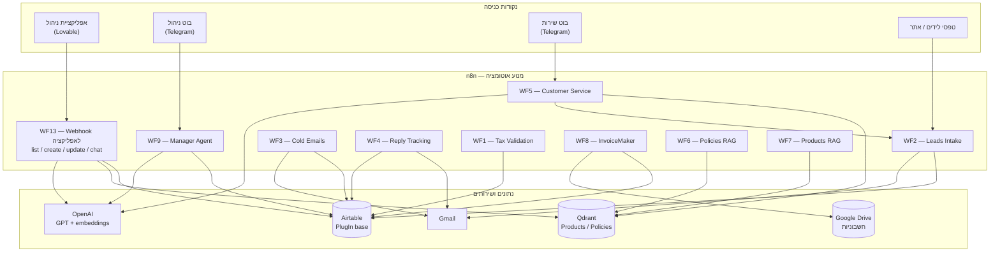

# ארכיטקטורה וזרימת מידע

## מבט על

המערכת בנויה סביב **Airtable** כמקור אמת יחיד, **n8n** כמנוע האוטומציה, ושכבת
**AI/RAG** (OpenAI + Qdrant) לצ'אטים ולמכירות. שלוש נקודות כניסה מפעילות את
המערכת: אפליקציית הניהול (Webhook), בוטים בטלגרם, וטריגרים מתוזמנים.

## זרימות מרכזיות

### מסע הליד
1. ליד נכנס דרך טופס/בוט → **WF2** בודק כפילות ב-Airtable ויוצר רשומה בסטטוס `New`.
2. **WF3** רץ כל 3 שעות, מוצא לידים בסטטוס `New`, מנסח מייל קר ב-AI, שולח, ומסמן `Contacted`.
3. **WF4** רץ כל 30 דקות, בודק תשובות ב-Gmail, ומסמן לידים שהגיבו כ-`Replied`.

### מסע החשבונית
1. **WF1** אוסף חשבוניות חדשות, מאמת (סכום > 0, יש לקוח), מחשב מע"מ וסה"כ,
   ממספר (`INV-XXXX`) ומסמן `Ready` (או `Invalid`).
2. **WF8** רץ כל דקה, מוצא חשבוניות `Ready` בלי PDF, בונה HTML, מעלה ל-Google Drive,
   כותב את הקישור ל-`PdfUrl` ומסמן `Issued`.

### שירות לקוחות (RAG)
- **WF6/WF7** טוענים מראש מדיניות ומוצרים ל-Qdrant.
- **WF5** (בוט טלגרם) עונה ללקוחות על סמך המידע שנשלף מ-Qdrant, ושומר לידים דרך WF2.

### ניהול
- **WF9** (בוט טלגרם, מוגבל ל-Chat ID של הבעלים) עונה על שאלות אנליטיקה
  (הכנסות, חשבוניות פתוחות) על סמך שליפה חיה מ-Airtable.
- **WF13** משרת את אפליקציית הווב: קריאה, יצירה ועדכון של רשומות, וצ'אט עם סוכן RAG.
